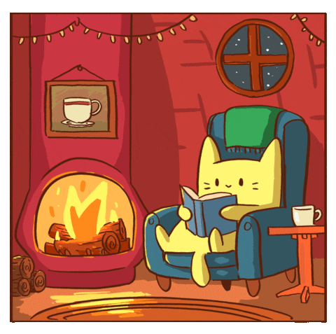

Hi 👋 My name is Elliana Petrin
===============================

Computer Science Student
------------------------

I am attending Eastern Washington University, working towards a Bachelor of Science in Computer Science. I also have 4 years of experience being a Crop Insurance Underwriter.

* 🌍  I'm based in Spokane WA
* ✉️  You can contact me at [epetrin@ewu.edu](mailto:epetrin@ewu.edu)
* 🧠  I'm learning C++, Graphics and Web Development
* ⚡  I was a barista for 7 years, ask me about anything about coffee!

### Skills

### Socials

 <a href="https://www.codepen.io/EllianaPetrin" target="_blank" rel="noreferrer"> <picture> <source media="(prefers-color-scheme: dark)" srcset="https://raw.githubusercontent.com/danielcranney/readme-generator/main/public/icons/socials/codepen-dark.svg" /> <source media="(prefers-color-scheme: light)" srcset="https://raw.githubusercontent.com/danielcranney/readme-generator/main/public/icons/socials/codepen.svg" />  </picture> </a> <a href="https://www.github.com/EllianaPetrin" target="_blank" rel="noreferrer"> <picture> <source media="(prefers-color-scheme: dark)" srcset="https://raw.githubusercontent.com/danielcranney/readme-generator/main/public/icons/socials/github-dark.svg" /> <source media="(prefers-color-scheme: light)" srcset="https://raw.githubusercontent.com/danielcranney/readme-generator/main/public/icons/socials/github.svg" />  </picture> </a>

### Goals
------------------------
The community I am most passionate about is the local music scene. I want to create things that help foster a healthy and independent scene.

